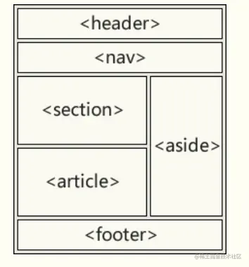

[原文](https://juejin.cn/post/7036257361417207821)

# HTML5 新特性（发布于 2014/10/28）

### 1. 语义标签

语义化标签使得页面的内容结构化，可以使开发者更方便清晰地构建页面的布局

| 标签        | 描述                             |
| ----------- | -------------------------------- |
| `<header>`  | 定义了文档的头部区域             |
| `<footer>`  | 定义了文档的尾部区域             |
| `<nav>`     | 定义文档的导航                   |
| `<section>` | 定义文档中的书                   |
| `<acticle>` | 定义页面独立的内容区域           |
| `<aside>`   | 定义页面侧边栏内容               |
| `<details>` | 定义用户可以看到或隐藏的额外细节 |
| `<summary>` | 标签包含 details 元素的标题      |
| `<dialog>`  | 定义对话框                       |
| `<figure>`  | 定义自包含内容，如图表           |
| `<main>`    | 定义文档主内容                   |



### 2. 增强型表单

#### 2.1 HTML5 新增 input 类型，改善更好的输入控制和验证

| 输入           | 类型描述                 |
| -------------- | ------------------------ |
| color          | 主要用于选取颜色         |
| date           | 选取日期                 |
| datetime       | 选取日期（UTC 时间）     |
| datetime-local | 选取日期（无时区）       |
| month          | 选择一个月份             |
| week           | 选择周和年               |
| time           | 选择一个时间             |
| email          | 包含 email 地址的输入域  |
| number         | 数值的输入域             |
| url            | url 地址的输入域         |
| tel            | 定义输入电话号码的字段   |
| search         | 用于搜索域               |
| range          | 一个范围内数字值的输入域 |

#### 2.2 HTML5 也新增了五个表单元素

| 标签         | 描述                                           |
| ------------ | ---------------------------------------------- |
| `<details>`  | 用户会在他们输入数据时看到域定义选项的下拉列表 |
| `<progress>` | 进度条，展示连接/下载进度                      |
| `<meter>`    | 刻度值，用于某些计量，例如温度、重量等         |
| `<keygen>`   | 提供一种验证用户的可靠方法，生成一个公钥和私钥 |
| `<output>`   | 用于不同类型的输出，比如计算或脚本输出         |

HTML5 新增表单属性

#### 2.3 HTML5 新增表单属性

| 属性         | 描述                             |
| ------------ | -------------------------------- |
| placehoder   | 输入框默认提示文字               |
| required     | 要求输入的内容是否可为空         |
| pattern      | 描述一个正则表达式验证输入的值   |
| min/max      | 设置元素最小/最大值              |
| step         | 为输入域规定合法的数字间隔       |
| height/wdith | 用于 image 类型标签图像高度/宽度 |
| autofocus    | 规定在页面加载时，域自动获得焦点 |
| multiple     | 规定元素中可选择多个值           |

### 3. 视频和音频

- 音频文件标准，`<audio>`

```html
<audio controls>
  <source src="horse.ogg" type="audio/ogg" />
  <source src="horse.mp3" type="audio/mpeg" />
  您的浏览器不支持 audio 元素。
</audio>
```

`control` 属性供添加播放、暂停和音量控件。
　在`<audio>` 与 `</audio>` 之间需要插入浏览器不支持的`<audio>`元素的提示文本 。
　`<audio>` 元素允许使用多个 `<source>` 元素. `<source>` 元素可以链接不同的音频文件，浏览器将使用第一个支持的音频文件。

目前, `audio` 标签支持三种音频格式文件: MP3, Wav, 和 Ogg

视频文件标准 `<video>`

```html
<video width="320" height="240" controls>
  <source src="movie.mp4" type="video/mp4" />
  <source src="movie.ogg" type="video/ogg" />
  您的浏览器不支持Video标签。
</video>
```

`control` 提供了 播放、暂停和音量控件来控制视频。也可以使用 dom 操作来控制视频的播放暂停，如 K 方法。
同时 `video` 元素也提供了 `width` 和 `height` 属性控制视频的尺寸.如果设置的高度和宽度，所需的视频空间会在页面加载时保留。如果没有设置这些属性，浏览器不知道大小的视频，浏览器无法在加载时保留特定的空间，页面就会根据原始视频的大小而改变。
在标签之间插入的内容是提供给不支持 `video` 元素的浏览器显示的。
`video` 元素支持多个 `source` 元素. 元素可以链接不同的视频文件。浏览器将使用第一个可识别的格式（ MP4, WebM, 和 Ogg）

### 4. Canvas 绘图

支持 `<canvas>`的浏览器会只渲染 `<canvas>` 标签，而忽略其中的替代内容。不支持 `<canvas>` 的浏览器则 会直接渲染替代内容。

用文本替换：

```html
<canvas> 你的浏览器不支持 canvas，请升级你的浏览器。 </canvas> 用  替换：

<canvas>
  
</canvas>
```

结束标签 `</canvas>` 不可省略。

与 `` 元素不同，`<canvas>` 元素需要结束标签(`</canvas>`)。如果结束标签不存在，则文档的其余部分会被认为是替代内容，将不会显示出来。

### 5. SVG 绘图

什么是 SVG：

- SVG 指可伸缩矢量图形
- SVG 用于定义用于网络的基于矢量的图形
- SVG 使用 XML 格式定义图形
- SVG 图像在放大或改变尺寸的情况下其图形质量不会有损失
- SVG 是万维网联盟的标准

SVG 的优势：

- SVG 图像可通过文本编译器来创建和修改
- SVG 图像可被搜索、索引、脚本化或压缩
- SVG 是可伸缩的
- SVG 图像可在任何的分辨率下被高质量的打印
- SVG 可在图像质量不下降的情况下被放大

SVG 与 Canvas 的区别：

- SVG 适用于描述 XML 中的 2D 图形的语言
- Canvas 随时随地绘制 2D 图形（使用 javaScript）
- SVG 是基于 XML 的，意味这可以操作 DOM，渲染速度较慢
- 在 SVG 中每个形状都被当做是一个对象，如果 SVG 发生改变，页面就会发生重绘
- Canvas 是一像素一像素地渲染，如果改变某一个位置，整个画布会重绘。

| Canvas               | SVG                                    |
| -------------------- | -------------------------------------- |
| 依赖分辨率           | 不依赖分辨率                           |
| 不支持事件处理器     | 支持事件处理器                         |
| 能够以.png 或.jpg    | 格式保存结果图像复杂度会减慢搞渲染速度 |
| 文字呈现功能比较简单 | 适合大型渲染区域的应用程序             |
| 最合适图像密集的游戏 | 不适合游戏应用                         |

### 6. 地理定位 Geolocation

HTML5 新增了 Geolocation 用于定位用户的位置；Geolocation 是 HTML5 标准下的一个 Web API,利用它可以获取设备的当前位置信息（坐标），此 API 具有三个方法：getCurrentPosition、watchPosition 和 clearWatch，其中最常用的是 getCurrentPosition 方法，剩下两个方法需要搭配使用！

```js
  window.navigator.geolocation {
    getCurrentPosition:  fn //  用于获取当前的位置数据
    watchPosition: fn // 监视用户位置的改变
    clearWatch: fn  // 清除定位监视
  }
```

获取用户定位信息

```js
navigator.geolocation.getCurrentPosition(
  function (pos) {
    console.log("用户定位数据获取成功"); //console.log(arguments);
    console.log("定位时间：", pos.timestamp);
    console.log("经度：", pos.coords.longitude);
    console.log("纬度：", pos.coords.latitude);
    console.log("海拔：", pos.coords.altitude);
    console.log("速度：", pos.coords.speed);
  }, //定位成功的回调

  function (err) {
    console.log("用户定位数据获取失败"); //console.log(arguments);
  } //定位失败的回调
);
```

### 7. 拖放 API

拖放是一种常见的特性，即捉取对象后拖到另一个位置

```html
<div draggable="true"></div>
```

当元素拖动时，我们可以检查其拖动的数据。

```html
<div draggable="true" ondragstart="drag(event)"></div>
<script>
  function drag(ev) {
    console.log(ev);
  }
</script>
```

| 拖动生命周期 | 属性名      | 描述                                           |
| ------------ | ----------- | ---------------------------------------------- |
| 拖动开始     | ondragstart | 在拖动操作开始时执行脚本                       |
| 拖动过程中   | ondrag      | 只要脚本在被拖动就运行脚本                     |
| 拖动过程中   | ondragenter | 当元素被拖动到一个合法的防止目标时，执行脚本   |
| 拖动过程中   | ondragover  | 只要元素正在合法的防止目标上拖动时，就执行脚本 |
| 拖动过程中   | ondragleave | 当元素离开合法的防止目标时                     |
| 拖动结束     | ondrop      | 将被拖动元素放在目标元素内时运行脚本           |
| 拖动结束     | ondragend   | 在拖动操作结束时运行脚本                       |

### 8. WebWorker

Web Worker 可以通过加载一个脚本文件，进而创建一个独立工作的线程，在主线程之外运行。
Web Worker 的基本原理就是在当前 javascript 的主线程中，使用 Worker 类加载一个 javascript 文件来开辟一个新的线程，
起到互不阻塞执行的效果，并且提供主线程和新县城之间数据交换的接口：postMessage、onmessage。

```js
onmessage = function (evt) {
  var d = evt.data; //通过 evt.data 获得发送来的数据
  postMessage(d); //将获取到的数据发送会主线程
};
```

```html
<!DOCTYPE html>

<html>
  <head>
    <meta http-equiv="Content-Type" content="text/html; charset=utf-8" />
    <script type="text/javascript">
      //WEB页主线程
      var worker = new Worker("worker.js"); //创建一个Worker对象并向它传递将在新线程中执行的脚本的URL
      worker.postMessage("hello world"); //向worker发送数据
      worker.onmessage = function (evt) {
        //接收worker传过来的数据函数
        console.log(evt.data); //输出worker发送来的数据
      };
    </script>
  </head>
  <body></body>
</html>
```

### 9. WebStorage

使用 HTML5 可以在本地存储用户的浏览数据。早些时候,本地存储使用的是 cookies。但是 Web 存储需要更加的安全与快速. 这些数据不会被保存在服务器上，但是这些数据只用于用户请求网站数据上.它也可以存储大量的数据，而不影响网站的性能。数据以 键/值 对存在, web 网页的数据只允许该网页访问使用。
WebStorage 拥有 5M 的存储容量，而 cookie 却只有 4K，这是完全不能比的。
客户端存储数据的两个对象为：

- localStorage - 没有时间限制的数据存储
- sessionStorage - 针对一个 session 的数据存储, 当用户关闭浏览器窗口后，数据会被删除。

API(以 localStorage 为例)：

- 保存数据：localStorage.setItem(key,value);
- 读取数据：localStorage.getItem(key);
- 删除单个数据：localStorage.removeItem(key);
- 删除所有数据：localStorage.clear();
- 得到某个索引的 key：localStorage.key(index);

### 10. WebSocket

WebSocket 协议为 web 应用程序客户端和服务端之间提供了一种全双工通信机制。
特点：

- 握手阶段采用 HTTP 协议，默认端口是 80 和 443
- 建立在 TCP 协议基础之上，和 http 协议同属于应用层
- 可以发送文本，也可以发送二进制数据。
- 没有同源限制，客户端可以与任意服务器通信。
- 协议标识符是 ws（如果加密，为 wss），如 ws://localhost:8023
