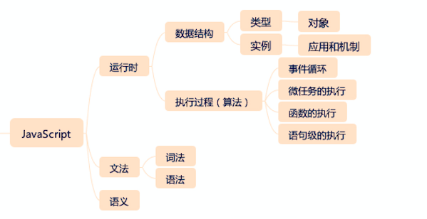
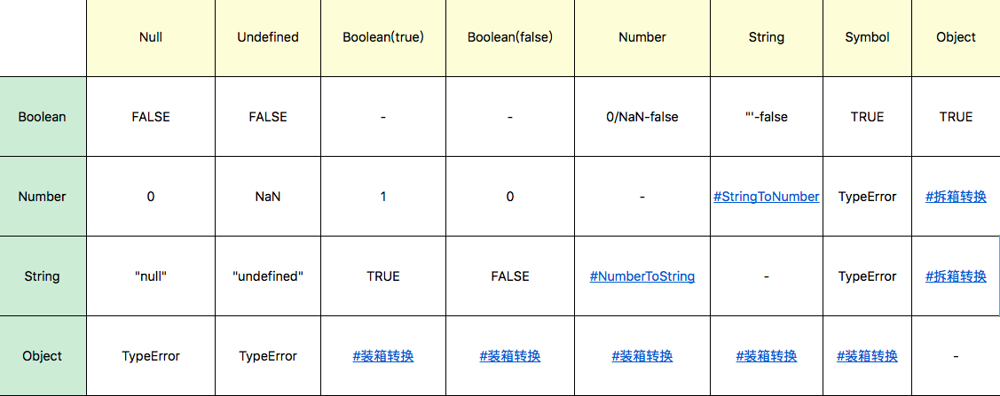

### 1. 给 JavaScript 知识做一个顶层目录：

- 文法
  - 词法
  - 语法
- 语义
- 运行时
  - 类型
  - 执行过程

为什么这样分呢，**因为对于任何计算机语言来说，必定是“用规定的文法，去表达特定语义，最终操作运行时的”一个过程。**

程序 = 算法 + 数据结构，那么，对运行时来说，类型就是数据结构，执行过程就是算法。



### 2. JavaScript 的类型

The ECMAScript language types are `Undefined`, `Null`, `Boolean`, `String`, `Symbol`, `Number`, `BigInt`, and `Object`. [Reference](https://tc39.es/ecma262/multipage/ecmascript-data-types-and-values.html#sec-ecmascript-language-types)

#### 2.1 Undefined, Null

| 区别        | `null`                   | `undefined`          |
| ----------- | ------------------------ | -------------------- |
| 定义方面    | 表示定义了但是为空       | 表示未定义           |
| 语法方面    | 是一个关键字，也是一个值 | 不是关键字，是一个值 |
| typeof      | `Object`,                | `undefined`          |
| 转成 number | 0                        | `NaN`                |

JavaScript 的代码 `undefined` 是一个变量，而并非是一个关键字，这是 JavaScript 语言公认的设计失误之一，所以，为了避免无意中被篡改，建议使用 `void 0` 来获取 `undefined` 值。

无意中篡改的例子：

```js
const test = () =>{ var undefined = 5; console.log(typeof undefined) //輸出 number }
```

#### 2.2 Number

JavaScript 中的 Number 类型有 18437736874454810627(即 2^64-2^53+3) 个值。JavaScript 中的 Number 类型基本符合 IEEE 754-2008 规定的双精度浮点数规则。

JavaScript 中有 +0 和 -0，在加法类运算中它们没有区别，但是除法的场合则需要特别留意区分，“忘记检测除以 -0，而得到负无穷大”的情况经常会导致错误，而区分 +0 和 -0 的方式，正是检测 1/x 是 `Infinity` 还是 `-Infinity`。

**典型例题：为什么在 JavaScript 中，0.1+0.2 不能 =0.3：**

```js
console.log(0.1 + 0.2 == 0.3);
```

这里输出的结果是 false，说明两边不相等的。这是浮点运算的特点，浮点数运算的精度问题导致等式左右的结果并不是严格相等，而是相差了个微小的值。所以实际上，这里错误的不是结论，而是比较的方法，正确的比较方法是使用 JavaScript 提供的**最小精度值(Number.EPSILON)**：

```js
console.log(Math.abs(0.1 + 0.2 - 0.3) <= Number.EPSILON);
```

#### 2.3 Object

JavaScript 语言设计上试图模糊对象和基本类型之间的关系，我们日常代码可以把对象的方法在基本类型上使用。比如：

```js
console.log("abc".charAt(0)); //a
```

甚至我们在原型上添加方法，都可以应用于基本类型，比如以下代码，在 Symbol 原型上添加了 hello 方法，在任何 Symbol 类型变量都可以调用。

```js
Symbol.prototype.hello = () => console.log("hello");

var a = Symbol("a");
console.log(typeof a); //symbol，a并非对象
a.hello(); //hello，有效
```

**为什么给对象添加的方法能用在基本类型上？**

- `.` 运算符提供了装箱操作，它会根据基础类型构造一个临时对象，使得我们能在基础类型上调用对应对象的方法。

#### 2.4 类型转换


